# tugas_praktikum1

Nama: Tyase Nisa'an Jamilaa

Kelas: 3H

Absen: 26

A new Flutter project.

## Getting Started

### **Add the Layout Widget to the Page**

### Material Apps

Material Apps menggunakan Material Design dari google yang cocok untuk aplikasi dengan tampilan android. Widget khas: Scaffold, AppBar, FloatingActionButton.

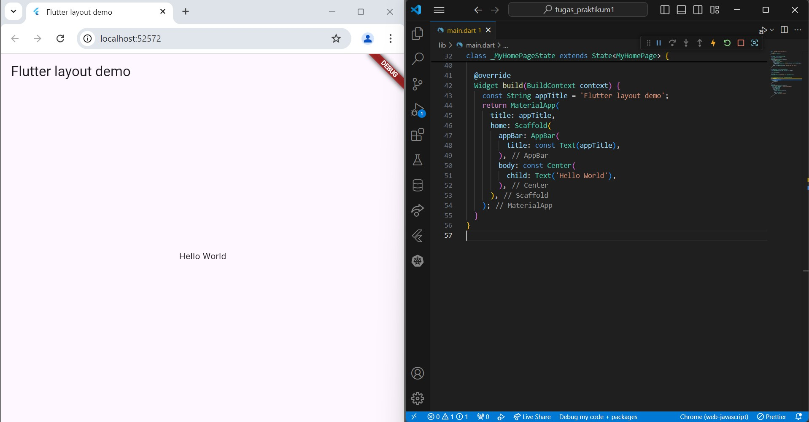

### Cupertino Apps

Cupertino Apps akan mengikuti gaya desain iOS dari Apple yang cocok untuk aplikasi dengan tampilan khas iPhone. Widget khas: CupertinoNavigationBar, CupertinoButton.

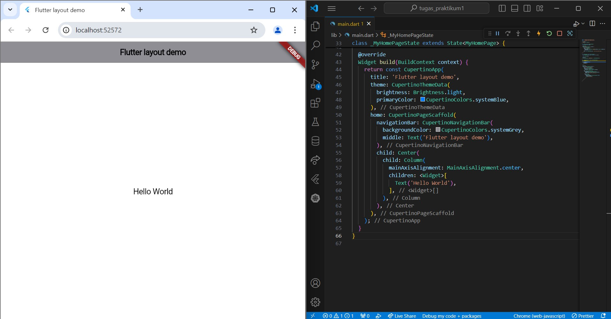

### Non-Material Apps

Non-Material Apps tidak terikat pada Material Design maupun Cupertino, desain kustom yang fleksibel untuk tampilan

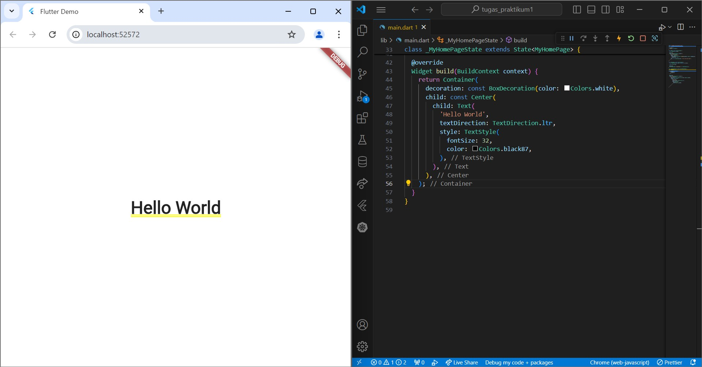

### **Lay Out Multiple Widgets Vertically and Horizontally**

horizontal column

Kode tersebut mendefinisikan sebuah widget Row dalam Flutter yang menampilkan tiga gambar secara horizontal dengan spasi yang rata di antara mereka menggunakan MainAxisAlignment.spaceEvenly (mengatur bahwa elemen-elemen di dalam baris akan diberi spasi yang sama di antara mereka. Dengan kata lain, akan ada ruang yang rata antara setiap gambar, serta di kiri dan kanan gambar pertama dan terakhir.)

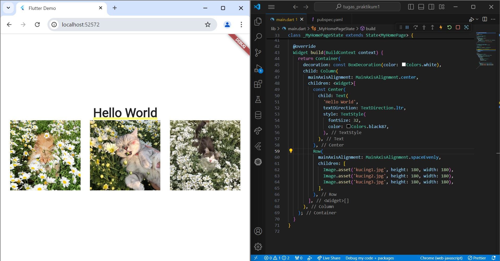

vertikal column

Kode tersebut mendefinisikan sebuah widget Column dalam Flutter yang menampilkan tiga gambar secara vertikal, dengan spasi yang rata di antara mereka menggunakan MainAxisAlignment.spaceEvenly.

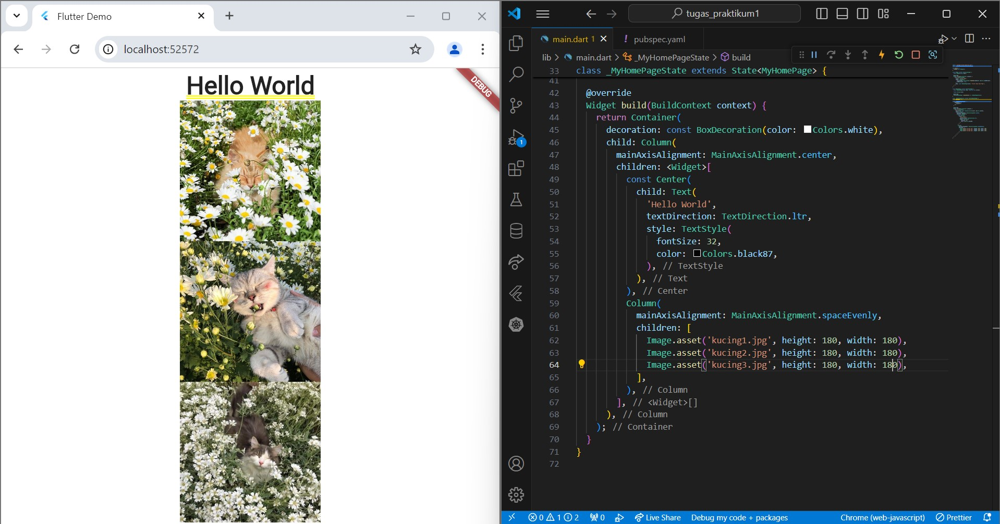

### **Sizing Widgets**

Apabila tata letak terlalu besar pada gambar, maka pola bergaris hitam-kuning akan muncul di sepanjang tepi yang melewati batas.

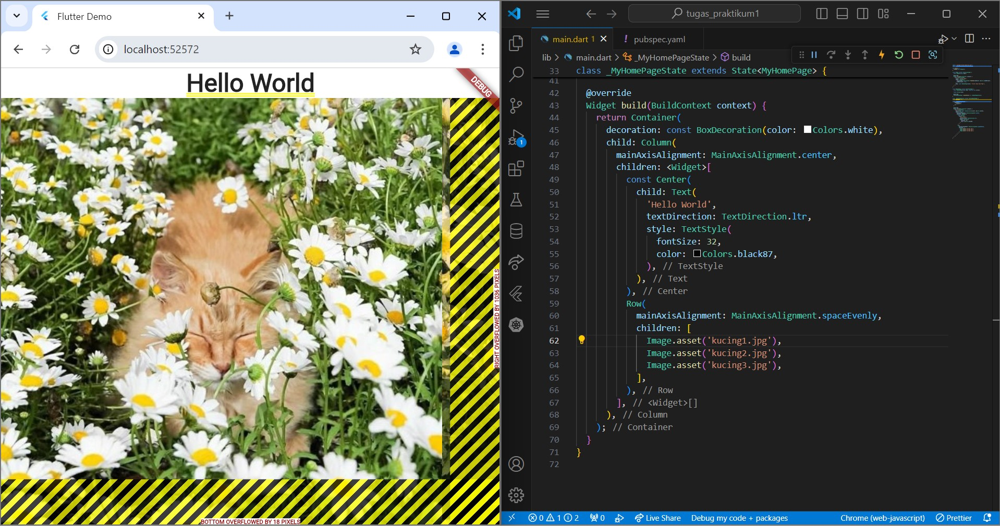

Kode tersebut akan menyusun gambar secara horizontal (row). crossAxisAlignment: CrossAxisAlignment.center digunakan untuk menyelaraskan semua anak widget di sepanjang sumbu silang (sumbu vertikal dalam hal ini), tepat di tengah baris. Expanded digunakan untuk memperluas dan mendapatkan ruang yang sama pada baris, tanpa expanded widget anak hanya akan mengambil ruang sebanyak yang dibutuhkan dan mungkin tidak merata atau tidak mengisi seluruh ruang.

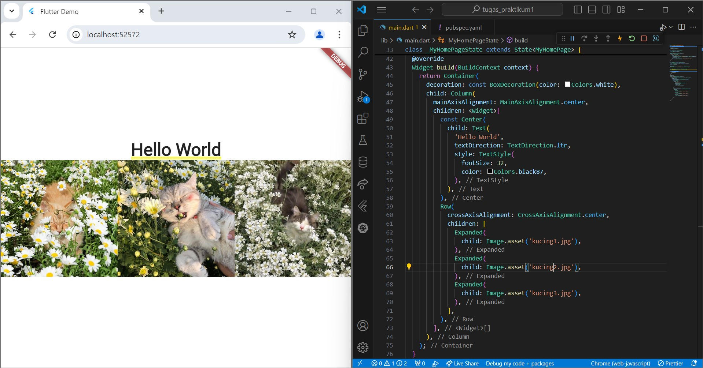

Kode ini kurang lebih sama seperti kode sebelumnya yang menggunakan expanded, namun pada gambar ke-2 menggunakan properti flex: 2, yang berarti gambar kedua akan mengambil bagian dari ruang yang tersedia dalam baris, sehingga total gambar terdapat 4 ruang dengan gambar 2 mengambil 2 bagian ruang sehingga tampak lebih besar.

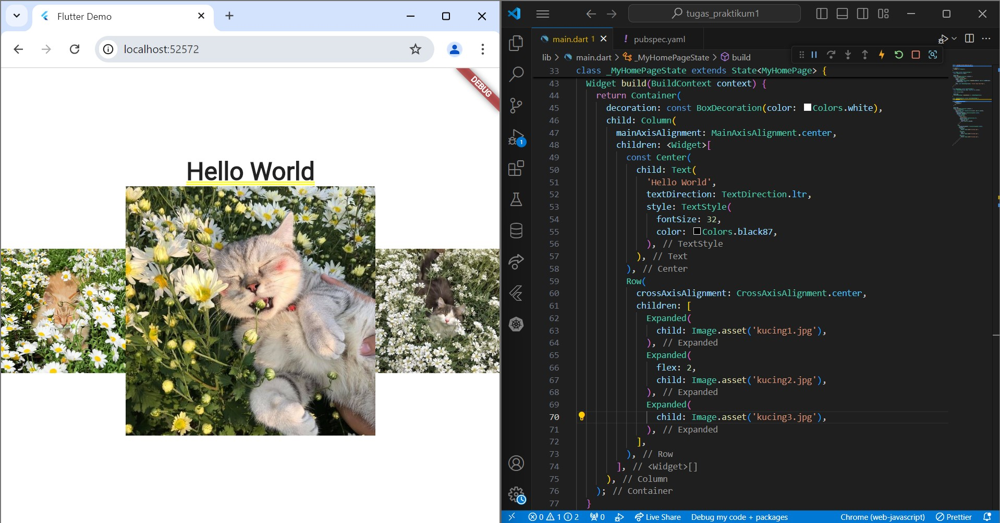

### **Packing widgets**

Kode ini menggunakan mainAxisSize: MainAxisSize.min yang berarti akan mengambil ruang minimum yang diperlukan widget, bukan menggunakan lebar penuh.

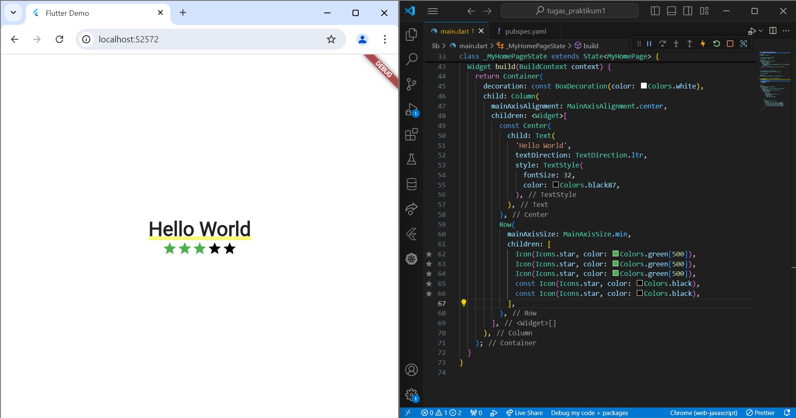

### **Nesting Rows and Columns**

Container digunakan untuk membungkus widget lainnya dan memberikan padding di sekelilingnya. Di sini, padding sebesar 20 piksel ditambahkan ke seluruh sisi. Dalam Container, terdapat Row lain yang berisi dua anak:
stars: Menyisipkan widget stars yang sudah didefinisikan sebelumnya.
Text: Menampilkan teks '170 Reviews' dengan beberapa gaya teks.

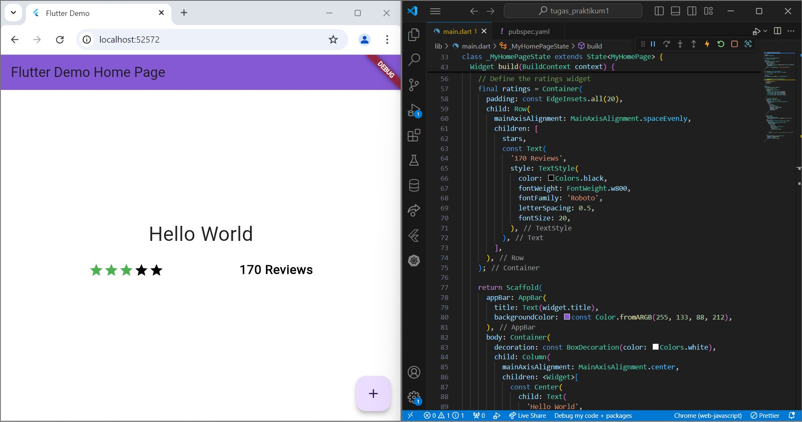

Kode ini digunakan untuk menampilkan informasi yang terkait dengan persiapan makanan dalam format yang terorganisir. Tiga kolom yang ditampilkan menunjukkan waktu persiapan, waktu memasak, dan jumlah porsi yang bisa disajikan.

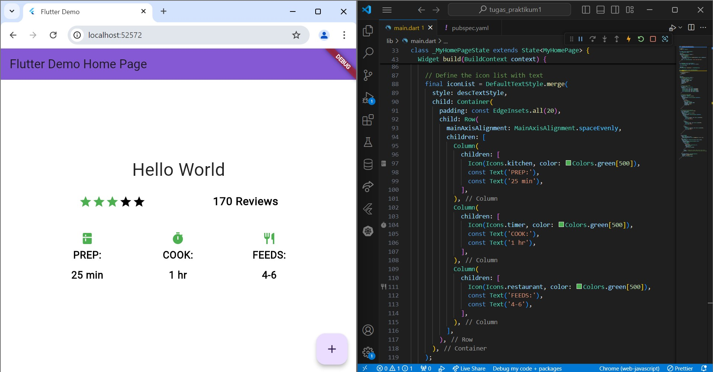

Selanjutnya terdapat penambahan image dan juga text untuk melengkapi halaman web, sehingga hasilnya pada gambar berikut:

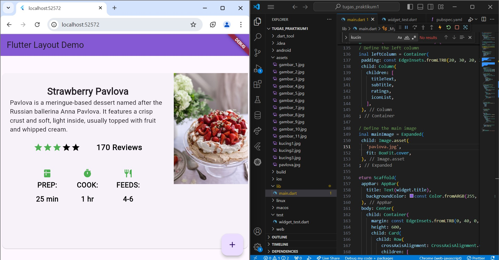

### **Common layout widgets**

### Container

Fungsi _buildImageColumn() mengembalikan sebuah widget yang merupakan kolom (Column) berisi gambar-gambar. Nama fungsi diawali dengan tanda garis bawah _, menandakan bahwa fungsi ini bersifat privat dan hanya dapat diakses dari dalam file tersebut.

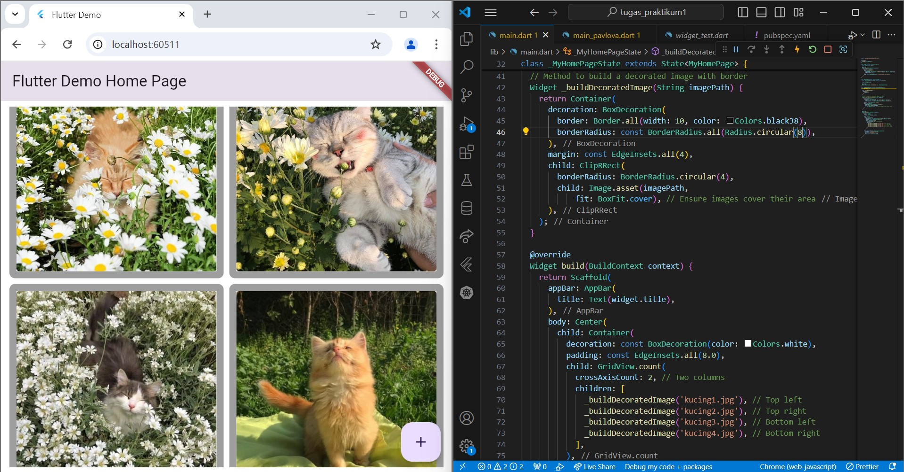

### GridView

kode ini membuat tampilan grid dari 30 gambar yang disimpan dengan nama file pic0.jpg hingga pic29.jpg. Setiap gambar ditampilkan dalam item grid dengan ukuran maksimum 150 piksel per item. Fungsi ini cocok digunakan dalam aplikasi yang memerlukan tampilan gambar dalam format kisi, seperti galeri foto atau aplikasi berbasis gambar.

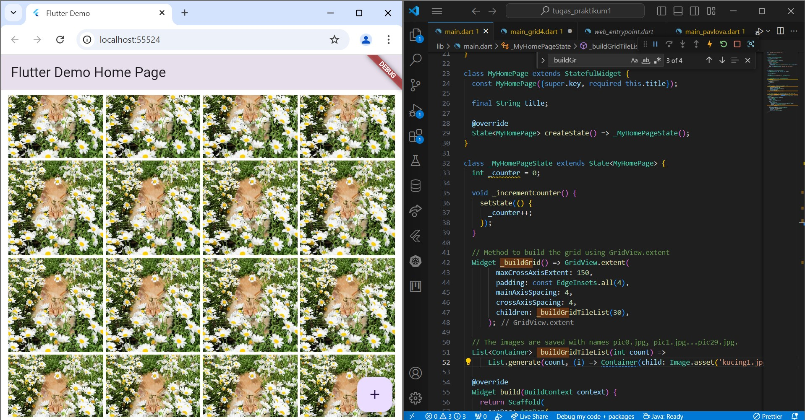

### ListView

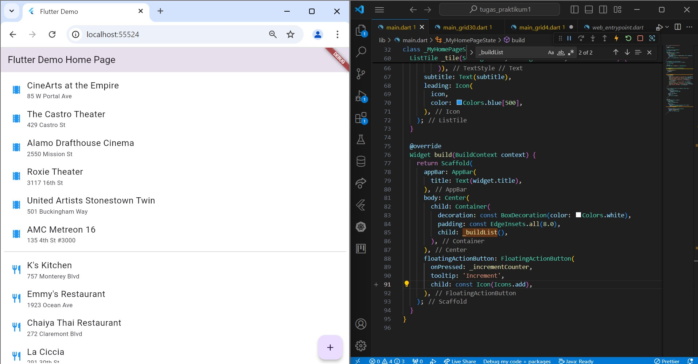

### **Stack**

kode ini membuat sebuah widget Stack yang menampilkan gambar profil berbentuk lingkaran dengan nama di atasnya. Gambar diambil dari file pic.jpg, dan teks memiliki latar belakang semi-transparan hitam untuk memastikan keterbacaan.

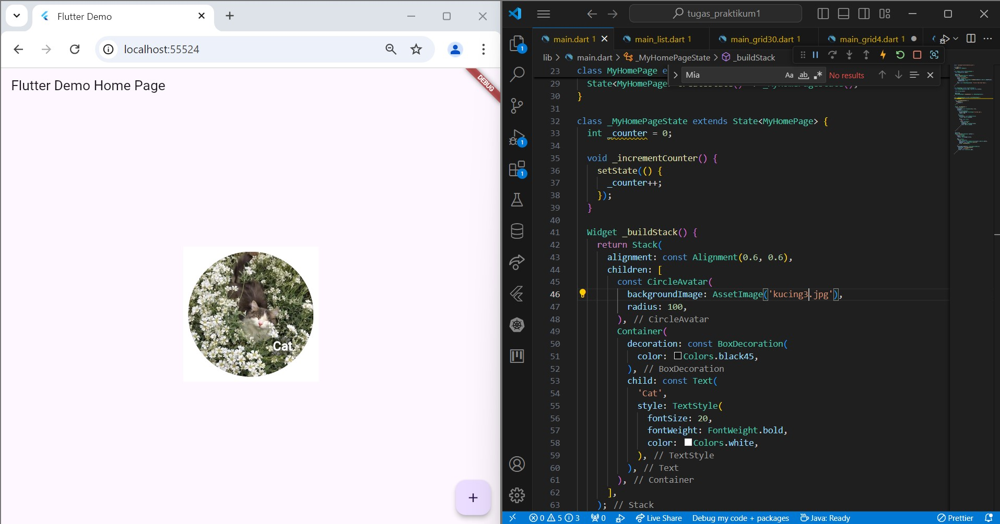

### **Summary**

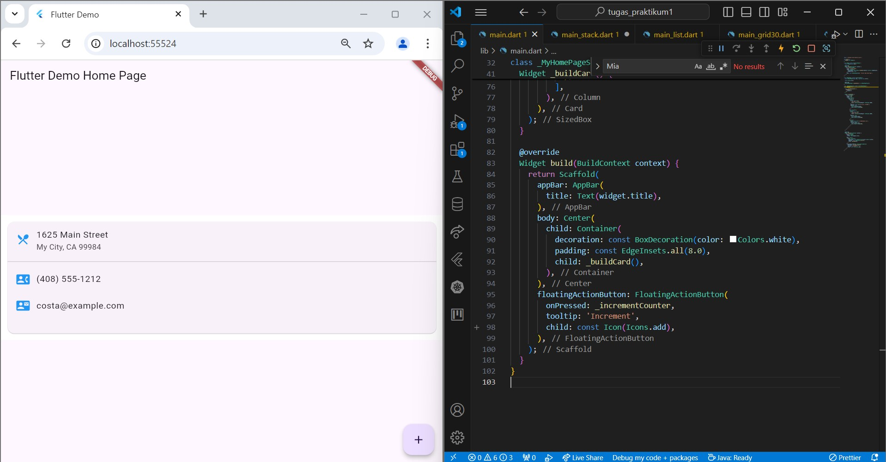

### **List Tile**

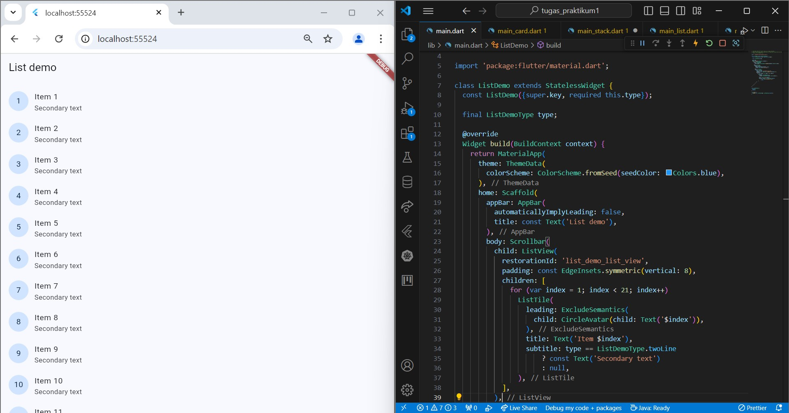

